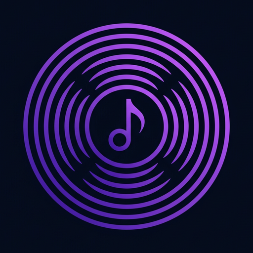

<div align="center">



# SonicWave

### Feel Every Beat 🎵

*A free, beautiful music streaming app — full songs, synced lyrics, Dolby Atmos spatial audio, smart recommendations and zero ads.*

[](https://sonicwave-gamma.vercel.app)
[](https://sonicwave-gamma.vercel.app)


</div>

---

## ▶ Listen online

No install needed — open **[sonicwave-gamma.vercel.app](https://sonicwave-gamma.vercel.app)**, create a free account (or sign in with Google) and start listening instantly.

## ⬇ Download / Install the app

SonicWave installs as a real app on **every platform** — no app store, no payment, ~1 MB:

| Platform | How to install |
|---|---|
| 🪟 **Windows 10 / 11** | Open the [site](https://sonicwave-gamma.vercel.app) in **Chrome** or **Edge** → click the **Install** icon in the address bar (or **Get App** button in the top bar) |
| 🍎 **macOS** | **Chrome** → Install icon in the address bar · **Safari** → File → **Add to Dock** |
| 🐧 **Linux** | **Chrome / Chromium** → Install icon in the address bar |
| 🤖 **Android** | **Chrome** → tap **⋮** → **Install app** |
| 📱 **iPhone / iPad** | **Safari** → **Share ⎙** → **Add to Home Screen** |

The installed app opens in its own window with its own icon, works on your home screen / dock / task bar, and stays in sync with your account everywhere.

## ✨ Features

- 🎧 **Full-length songs** — real 320 kbps streams, not 30-second previews
- 🔍 **One-box search** — songs, artists and albums from multiple catalogs at once
- 🎙 **Synced lyrics** — karaoke-style line-by-line highlighting while the song plays
- 🌌 **Dolby Atmos–style spatial audio** — immersive Web-Audio processing with one switch
- 🧠 **Smart recommendations** — based on what *you* play, tuned to your country
- 📊 **Top charts** — country-aware charts (USA, Pakistan, India, UK and more)
- ❤️ **Likes & Library** — every like, play and playlist saved to your account
- 📝 **Playlists** — 100% user-created, with custom cover art uploads
- 👤 **Profiles** — display name, preset avatars or your own photo; Google sign-in supported
- 🔁 **Queue, shuffle, repeat & repeat-one** · ⏰ **Sleep timer** · ⌨️ **Keyboard shortcuts**
- 🎨 **Dark & light themes** with a premium Spotify × Apple-Music design language
- 🖼 **Ambient artwork backdrop** that melts the player into the album art
- 📱 **Installable PWA** — behaves like a native app on phone and desktop
- 🛡 **Privacy-first** — legal-grade privacy policy, cookie consent that actually works
- 🚀 **Resilient streaming engine** — two-phase stream resolution (inspired by [Nuclear](https://nuclearplayer.com)): every track gets ranked stream candidates from multiple providers with just-in-time URL resolution, automatic expiry refresh and silent fallback if a source fails mid-song

## 🎵 Streaming sources

Audio and metadata are retrieved from various internet sources:

- **JioSaavn** — primary full-song catalog (320 kbps AAC)
- **YouTube Music** — server-relayed audio streams
- **Audius** — decentralized, artist-first streaming (320 kbps MP3)
- **Apple Music / iTunes** — charts and catalog metadata
- **Deezer** — artist metadata and related artists
- **LRCLIB** — synchronized lyrics
- **Wikipedia** — artist biographies

## 🛠 Technical stack

- **FastAPI** (Python) — REST API, auth, streaming engine
- **PostgreSQL** (Neon) — accounts, likes, playlists, plays
- **Vanilla JS SPA** — zero frameworks, zero build step, instant loads
- **Web Audio API** — spatial audio engine
- **PWA** — service worker + manifest for installability
- **Vercel** — serverless hosting

## 💻 Available platforms

- **Web** — any modern browser
- **Windows** (10, 11) — installable PWA
- **macOS** — installable PWA
- **Linux** — installable PWA
- **Android** — installable PWA
- **iOS / iPadOS** — Add to Home Screen

## 🔌 Public API

The backend exposes a documented REST API — open [`/docs`](https://sonicwave-gamma.vercel.app/docs) for interactive Swagger docs. Highlights:

```
GET /api/music/search?q=…        search real songs across engines
GET /api/stream/candidates?…     streaming engine: ranked stream candidates
GET /api/stream/resolve?id=…     streaming engine: just-in-time playable URL
GET /api/charts?country=…        country top charts
GET /api/lyrics?…                synced lyrics
```

## 🚀 Self-hosting

1. Fork this repo
2. Create a free [Neon](https://neon.tech) Postgres database
3. Import the repo into [Vercel](https://vercel.com) and set `DATABASE_URL` in the project environment
4. Deploy — the database migrates itself on first request

## ⚠️ Disclaimer

> SonicWave was created for **music discovery purposes only**. It retrieves audio from publicly available streaming sources and does not host any music itself, does not use premium accounts, and has no download feature. If you find music you love, please **support the artists** — buy their records, merch or concert tickets, and subscribe to a licensed streaming service.

## 🔒 Privacy

See the full [Privacy Policy](https://sonicwave-gamma.vercel.app/privacy) — GDPR / CCPA aware, with working cookie consent.

## 📄 License

MIT © [Shayan Khan](https://github.com/ShayanKhan250)
